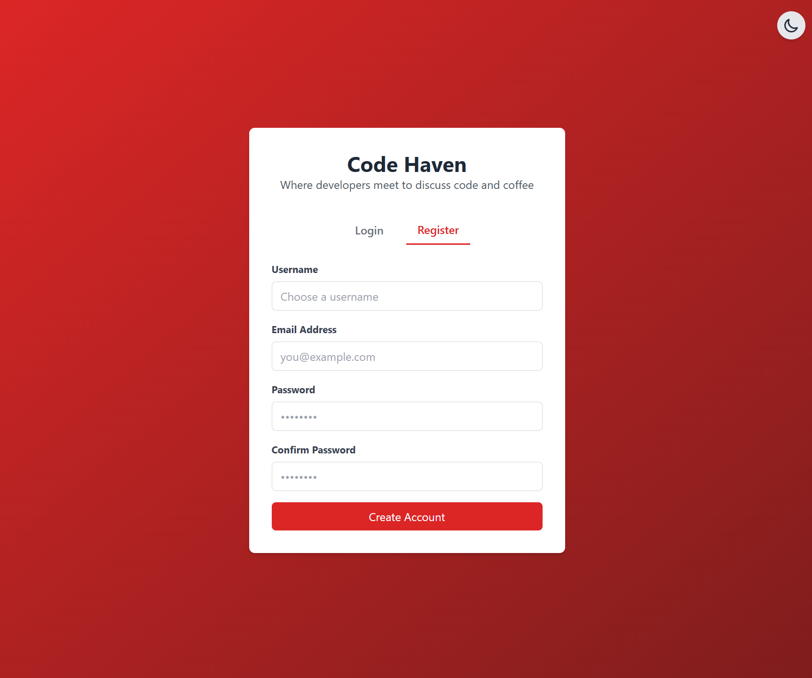
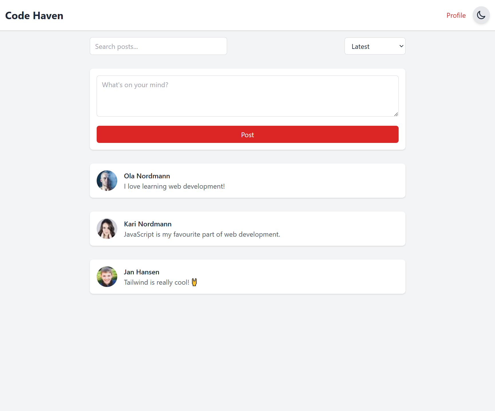

# CSS Frameworks Course Assignment

## Code Haven - Social Media Platform

A social media platform for developers built with Tailwind CSS, focusing on clean design and dark mode support. This was built as part of an assignment.

## Requirements

The requirements of this assignment was to build a social media app using HTML and Tailwind.

The app should have user authentication forms, a social feed with posts and a user profile.

JavaScript implementations were not required, however I have added some basic functionality to darkmode within the app.

## Screenshots

| Category       | Details                                |
| -------------- | -------------------------------------- |
| Login          |        |
| Register       |  |
| Login (Dark)   |  |
| Profile        |    |
| Profile (Dark) |     |
| Feed           |       |
| Feed (Dark)    |        |

## Installation

1. Clone the repository

```bash
git clone git@github.com:martink-rsa/css-frameworks-ca.git
```

2. Navigate to the project folder

```bash
cd css-frameworks-ca
```

3. Install the dependencies

```bash
npm install
```

## Running the project

1. Start the development server

```bash
npm run dev
```

2. Open the browser and navigate to `http://localhost:3000`
